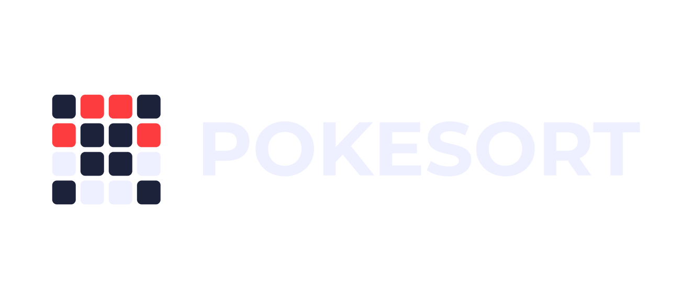

# Sonhario - API

Um puzzle diário de associação de Pokémon construído em Next.

## Tecnologias Utilizadas
* [Next.js](https://nextjs.org/)
* [MongoDB](https://www.mongodb.com/)
* [PokeAPI](https://pokeapi.co/)

## Como Começar

### Prerequisitos

* Node

### Instalação

1. Clone o repositório

   ```bash
   git clone https://github.com/bunny-sammy/pokesort.git
   cd pokesort
   ```

2. Instale as dependências

   ```bash
   npm install
   ```

3. Crie suas variáveis de ambiente
   ```bash
   cp .env.example .env
   # Ou no Windows
   copy .env.example .env
   ```

4. Inicie o servidor de desenvolvimento

   ```bash
   npm run dev
   ```